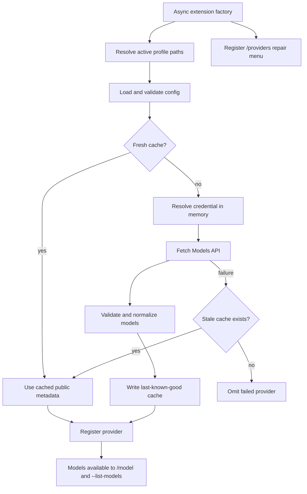

# Architecture

## Runtime flow

## Module boundaries

| Module | Responsibility |
|---|---|
| `src/index.ts` | Host entry point and provider registration |
| `src/config.ts` | Profile paths, trust-boundary validation, atomic config writes |
| `src/credentials.ts` | In-memory reference resolution and Pi/OMP syntax translation |
| `src/discovery.ts` | HTTP safety, OpenAI/Anthropic adapters, normalization, orchestration |
| `src/cache.ts` | Last-known-good public metadata persistence |
| `src/menu.ts` | Portable `/providers` interaction |
| `src/types.ts` | Shared versioned contracts and conservative defaults |

## Portability strategy

Pi and OMP expose overlapping provider and command APIs but differ in credential-reference syntax:

- Pi environment reference: `$API_KEY`
- OMP environment reference: `API_KEY`
- Both command references: `!command`

Configuration stores the host-neutral environment variable name. `credentials.ts` detects the host extension surface and translates only at provider registration time.

OMP exposes `fetchDynamicModels`; Pi does not. The extension intentionally uses its own small fetch/cache implementation so startup, TTL, diagnostics, and outage behavior remain identical.

## Trust boundaries

`provider-discovery.json` is operator-controlled but treated as untrusted input:

- schema version checked
- provider IDs constrained
- duplicate IDs rejected
- HTTPS required outside localhost
- discovery path traversal rejected
- timeouts bounded
- credential kind/reference validated
- model numbers required to be finite and non-negative/positive as appropriate

Remote Models API responses are also untrusted:

- redirects rejected
- response pages limited to 4 MiB
- JSON shape validated
- Anthropic pagination capped and cursor loops rejected
- model IDs deduplicated
- malformed or empty results cannot replace cache

## Secret lifecycle

1. Config supplies an environment variable name or command.
2. Discovery resolves it immediately before a request.
3. The value is placed only in request headers.
4. Errors never include headers or response bodies.
5. Cache receives normalized model metadata only.
6. Provider registration receives the original unresolved reference.

## Failure isolation

Providers discover concurrently. One provider failure does not block others. A failed provider uses matching cache when available; otherwise only that provider is omitted. `/providers` is registered before configuration loading, so malformed configuration remains repairable from the running host.
